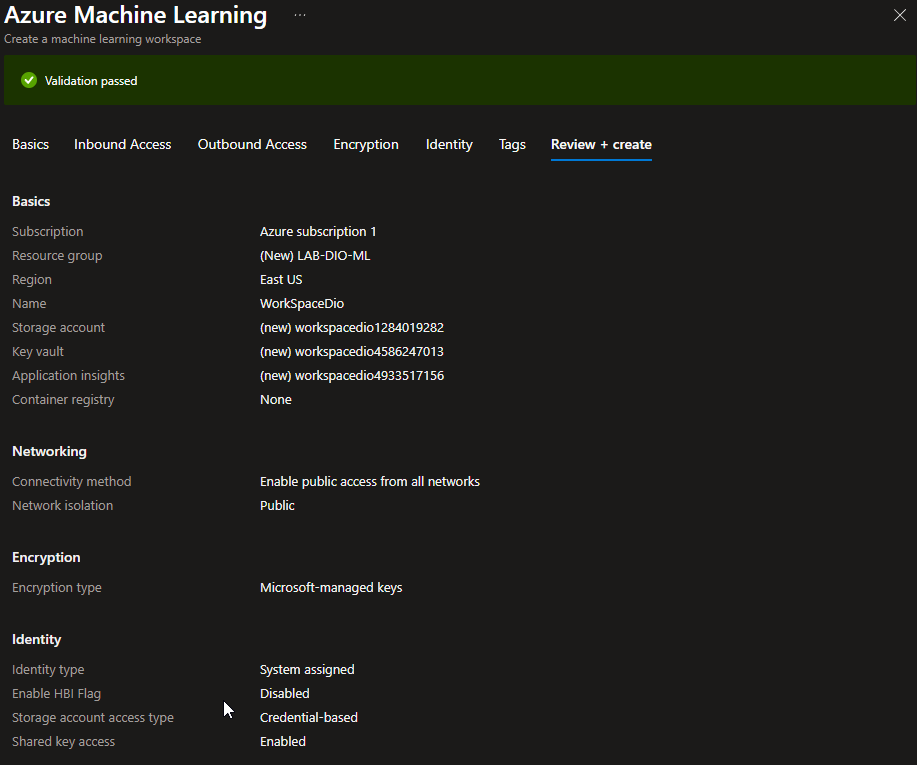
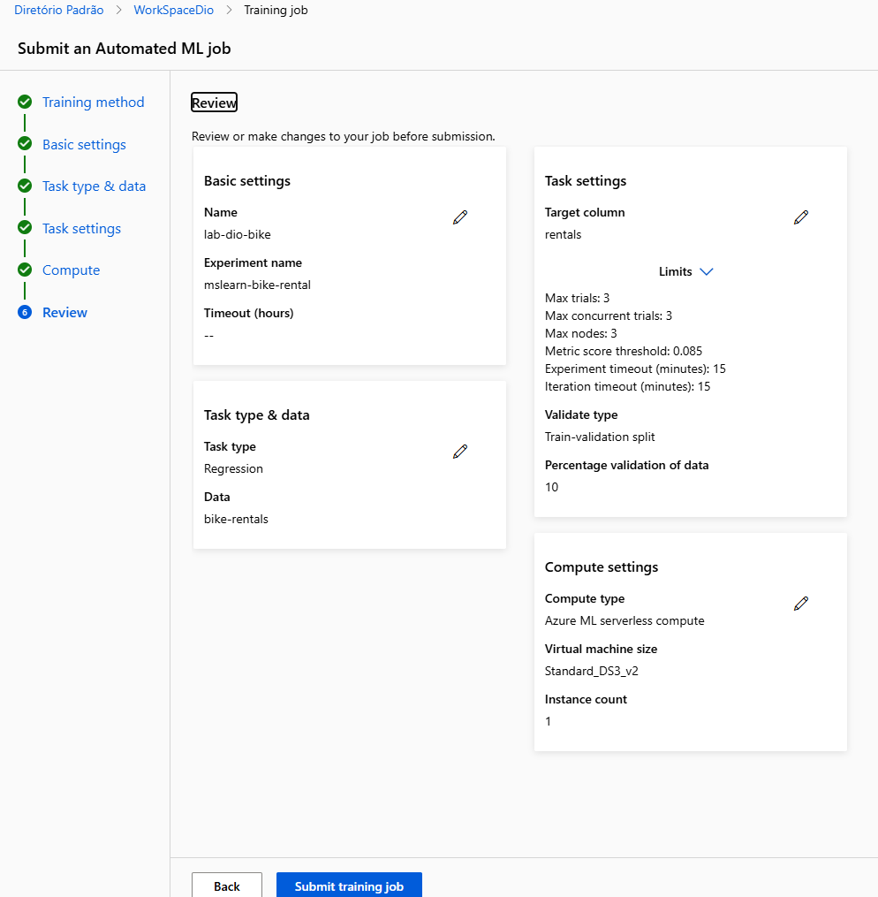
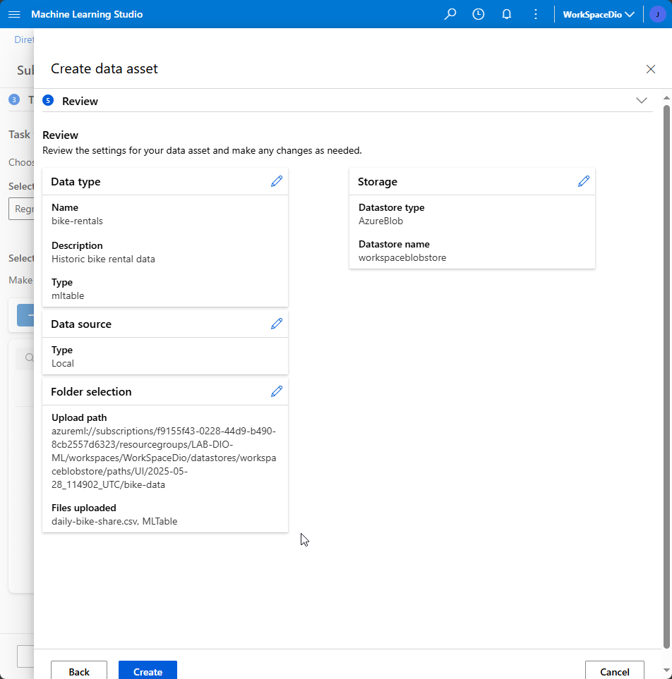
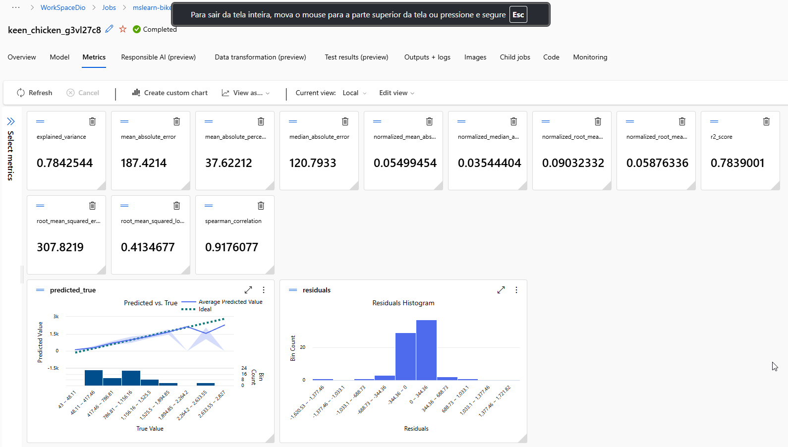
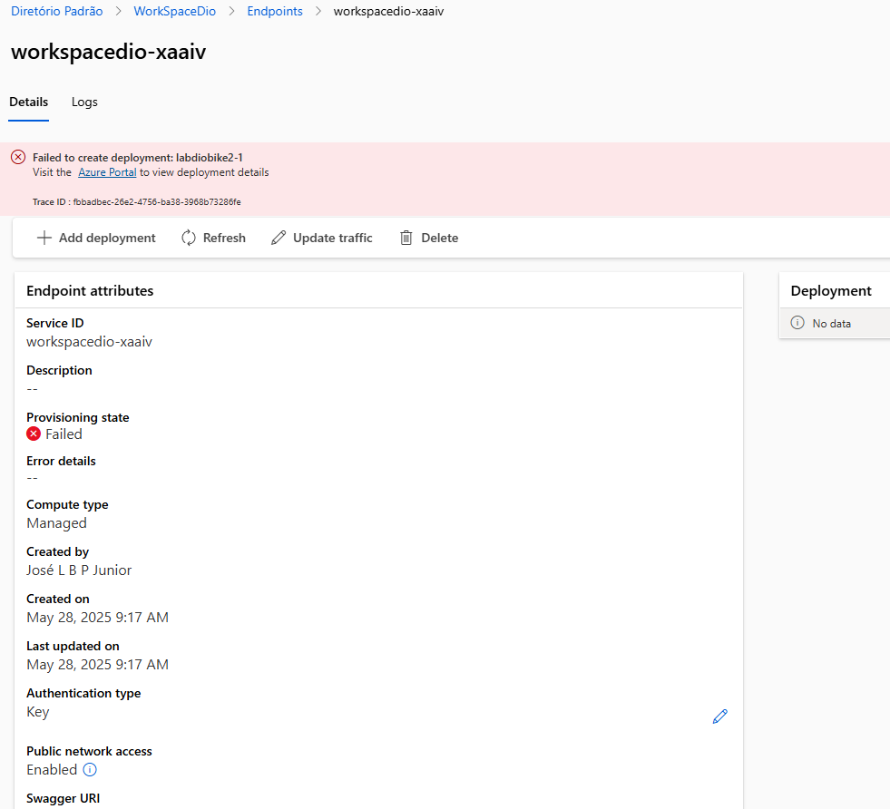

# lab-azure-ml
Resumo de criação de modelo de machine learning usando Azure AI.

## 📌 Objetivo

- Criar um workspace no Azure ML.
- Treinar um modelo de regressão com dados tabulares.
- Implantar um endpoint para disponibilizar o modelo via API.
- Documentar todo o processo.

## 🧠 Etapas realizadas

### 1. Criação do ambiente

### 2. Carregamento e preparo dos dados

### 3. Resultados 

Por limitações da conta trial, o endpoint para testes não pode ser criado.

Fonte:
